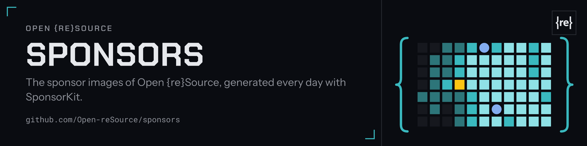

<picture><source srcset=".github/header.svg" type="image/svg+xml"></picture>

# Sponsors

This repository is a host for static files used to display sponsors in other repositories.

It has been created from [SponsorKit Starter Template](https://github.com/open-reSource/sponsorkit-starter).

## Generated files

### `sponsors.part1.svg`

  

### `sponsors.part2.svg`

  

### `sponsors.svg`

  

### `sponsors.wide.svg`

  

The Open {re}Source mark and the header image (`.github/header.*`) are not covered by the licence of this repository: all rights reserved.
